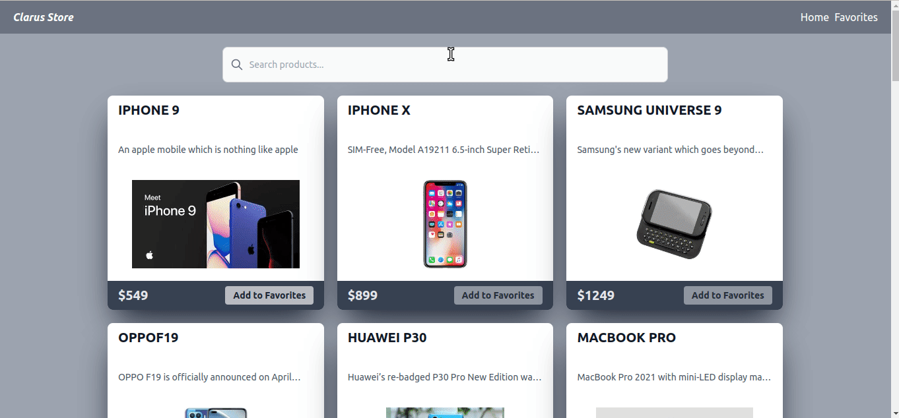

# Typescript React Redux Shopping App

## Overview

This project is a simple shopping app built with React and Redux, showcasing the integration of state management with Redux, asynchronous data fetching, and Cypress testing.



## Project Skeleton

```
Clarus Store with Typescript+Tailwindcss+Redux-Toolkit

SOLUTION
├── src
│    ├── index.css
│    ├── index.tsx
│    ├── App.tsx
│    ├── app
│    │   ├── hooks.ts
│    │   └── store.ts
│    ├── components
│    │   ├── Card.tsx
│    │   ├── Navbar.tsx
│    │   └── SearchComp.tsx
│    ├── features
│    │   └── productsSlice.ts
│    ├── models
│    │   └── models.ts
│    ├── pages
│    │   ├── FavoritesPage.tsx
│    │   └── Home.tsx
│    └── react-app-env.d.ts
├── package.json
├── README.md
├── tailwind.config.js
├── tsconfig.json
└── yarn.lock
```

## Components

### Home Component

The `Home` component is the main page of the application, responsible for displaying a list of products fetched from a dummy API. Key features include:

- Utilizes the `SearchComp` component for searching products.
- Implements Redux state management for loading, error handling, and maintaining the list of products and favorites.
- Uses Axios for asynchronous data fetching.
- Dynamically renders product cards using the `Card` component.
- Provides functionality to add products to favorites with appropriate notifications.

### FavoritesPage Component

The `FavoritesPage` component displays a list of favorited products. Key features include:

- Utilizes Redux state to manage the list of favorite products.
- Implements functionality to remove products from favorites with appropriate notifications.

### Card Component

The `Card` component represents a product card displayed in both the `Home` and `FavoritesPage` components. Key features include:

- Displays product information, including title, description, price, and an image.
- Supports dynamic rendering based on the page context, providing different functionality for adding/removing products.

### SearchComp Component

The `SearchComp` component is responsible for handling product search functionality. Key features include:

- Provides a search input field for users to input search queries.
- Utilizes the `handleChange` event function passed as a prop to manage search input changes.

### NavBar Component

The `NavBar` component represents the navigation bar of the application. Key features include:

- Includes navigation links for the Home page and Favorites page using the React Router.

## Redux State Management

The application uses Redux for state management, with the following slices:

### productsSlice

The `productsSlice` includes reducers and actions for managing products-related state, such as loading, errors, the list of products, and the list of favorites.

- Provides actions for fetching products, adding products to favorites, removing products from favorites, and handling loading and error states.

### Redux Store Configuration

The Redux store is configured using `configureStore` from the `@reduxjs/toolkit` library. The store combines the `productsReducer` from the `productsSlice`.

## Cypress Test Cases

The project includes Cypress test cases to ensure the functionality of critical features:

### Firms Test

This Cypress test suite checks the functionality related to firms. It logs in, navigates to the firms section, and asserts the visibility of relevant elements.

### Login Test

This Cypress test suite covers the login functionality. It ensures that the login process works correctly by providing valid credentials.

### Register Test

This Cypress test suite focuses on the registration process. It navigates to the registration page, fills in the required information, and submits the registration form.

## Helper Functions

### Toast Notifications

The project includes helper functions for displaying toast notifications. These functions are used to notify users of success or warning messages during various actions.

## Conclusion

This README provides an overview of the React Redux shopping app, detailing its components, state management with Redux, and Cypress test cases. It serves as documentation for developers working on or exploring the features and functionalities of this application.
